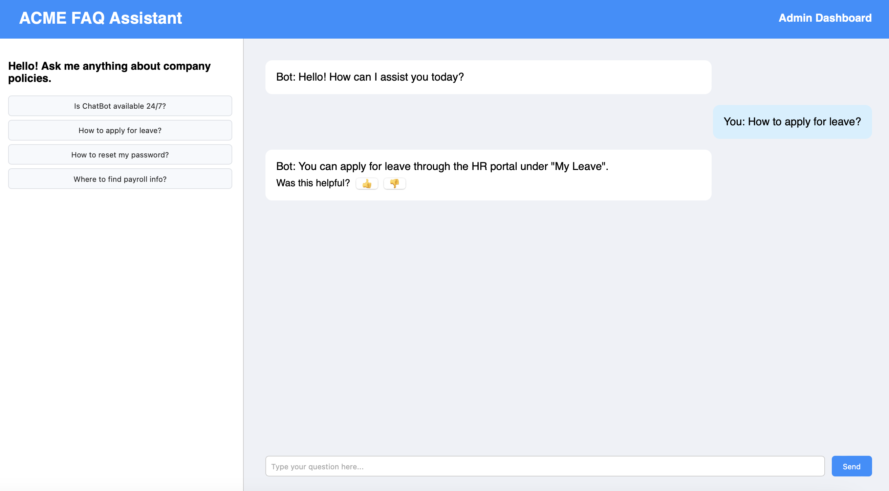
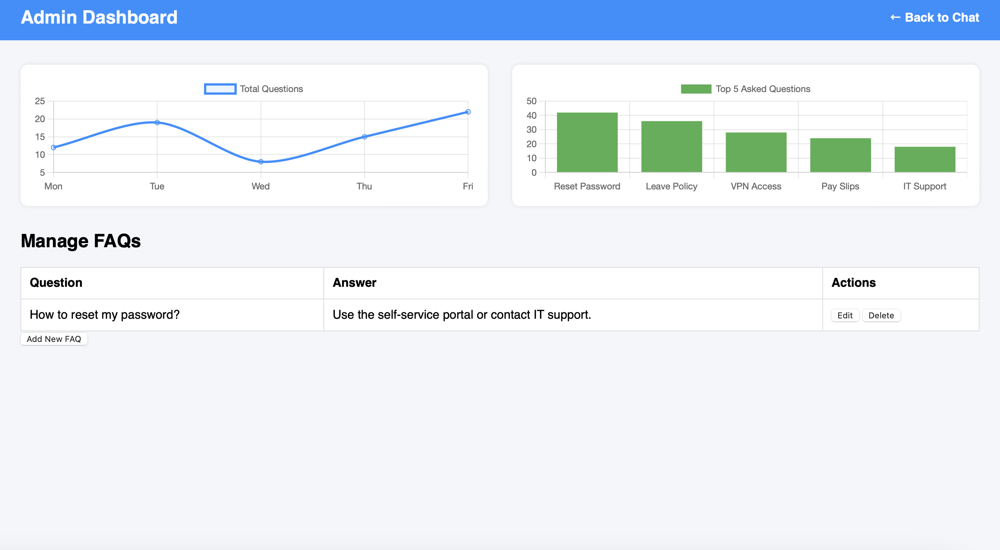
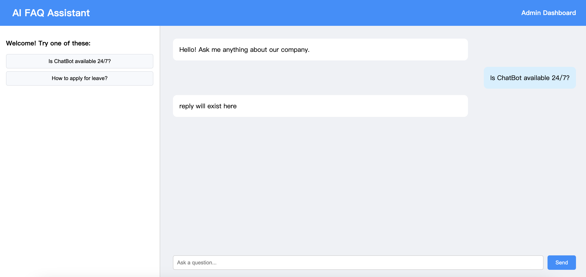
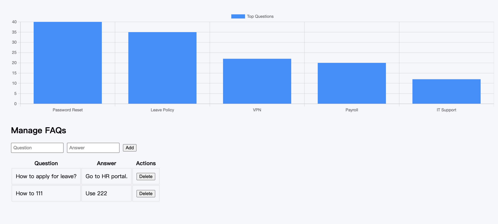

# Capstone Project - AI FAQ Assistant - Milestone 1

This is a full-stack web-based FAQ chatbot assistant developed for internal employee support at Acme Tech Inc. It is built as part of the capstone project and contains requirements of three programming labs:

- Lab 1 – Static HTML/CSS prototype &#x20;
- Lab 2 – React SPA frontend with state and routing &#x20;
- Lab 3 – Flask backend API + frontend integration (CRUD, Axios)

```bash 
AI-FAQ-CLIENT/
├── ai-faq-lab1/         # Lab 1 - HTML/CSS static prototype
│   ├── chat.html
│   ├── admin.html
│   └── style.css

├── ai-faq-lab2/         # Lab 2 - React front-end SPA
│   ├── src/
│   │   ├── pages/       # chatpage.js, adminpage.js (adminpage.js has 2 version for lab 2 and 3)
│   │   ├── components/  # chatinput, messagebubble, chartdashboard
│   │   └── style.css
│   └── public/
│       └── index.html

├── faq-backend/         # Lab 3 - Flask API backend
│   ├── app.py
│   └── venv/

├── .gitignore
└── README.md

```


## Lab 1 - HTML & CSS Prototype

**Location**:`/ai-faq-lab1/`

**Deliverables**:

- `chat.html`– user interface mockup
- `admin.html`– dashboard mockup with static table and chart
- `style.css`– layout, navigation, input forms

**Lab 1 Requirements Met**:

- Basic HTML elements
- Applied styling with external CSS file
- Multi-page navigation (`chat.html & admin.html`)
- GitHub Pages deployed static site

<div align="center">


</div>

## Lab 2 - React Front-End (SPA)

**Location**:`/ai-faq-lab2/`

**Deliverables**:

- `chatpage.js`– state-driven message display & quick response buttons
- `adminpage.js`– reused ChartDashboard + routed page
- `App.js`– configured routing using`react-router-dom`
- `style.css`– reused and enhanced for React components

**Lab 2 Requirements Met**:

- Project bootstrapped with`create-react-app`
- DOM manipulation via`useState`
- Components:`chatinput`,`messagebubble`
- Routing implemented with React Router

<div align="center">

</div>

## Lab 3 – API Integration with Flask

**Location**:

- Frontend:`/ai-faq-lab2/pages/adminpage.js`
- Backend:`/faq-backend/app.py`

**Deliverables**:

- Flask API with`GET`,`POST`, and`DELETE`endpoints
- React Axios requests to backend
- Admin can add/delete FAQs dynamically
- Debug feedback for loading/error states

**Lab 3 Requirements Met**:

- Data fetched via`axios`from Flask API
- FAQ management UI **replaces Todo List requirement**
- Stateful form with input validation and feedback
- Error handling: “Loading...”, “Failed to load FAQs”

<div align="center">

</div>

## How to build and run

#### Front-end (React)

```bash 
cd ai-faq-lab2
npm install
npm start
```


#### Back-end (Flask API)

```bash 
cd faq-backend
source venv/bin/activate
python app.py

```


Open your browser to:

- Chat UI →`http://localhost:3000`
- Admin Dashboard →`http://localhost:3000/admin`
